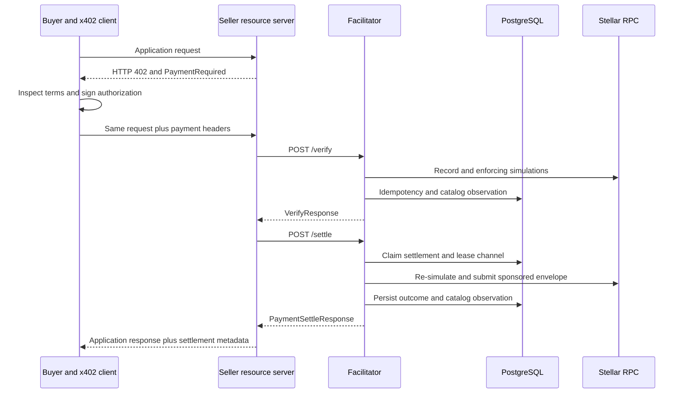
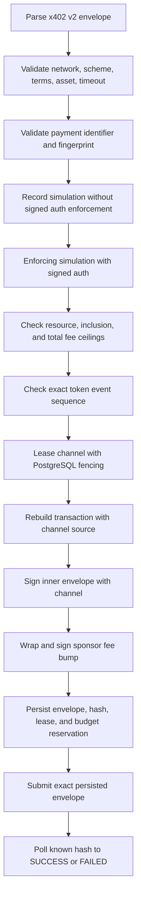
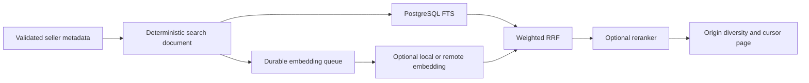

openx402 separates payment authorization, seller application execution,
fee-sponsored settlement, cataloging, and agent discovery. The facilitator
never proxies the seller's application request and never executes seller code.

## System boundaries

### Buyer/client boundary

The buyer owns its Stellar signer and decides whether the advertised network,
asset, amount, recipient, and timeout are acceptable. It constructs the signed
Soroban authorization. Buyer secrets never belong in the facilitator, seller,
browser bundle, or hosted discovery MCP.

### Seller/resource-server boundary

The seller owns the application route and its x402 middleware. It returns the
402 challenge, receives the paid retry, calls the facilitator, and returns the
application result. The seller address in `payTo` receives the payment asset.
The seller may attach Bazaar metadata describing the public URL that the buyer
actually calls.

### Facilitator boundary

The facilitator parses and validates the standard x402 request, simulates the
Stellar authorization, enforces operator fee and asset policy, sponsors fees,
submits settlement, and polls the result. It is not payer, recipient, seller
proxy, or custodian of seller funds.

Cataloging is a post-decision side effect. Metadata failure cannot turn a valid
payment into an error. Seller descriptions, schemas, tags, examples, and icon
URLs remain untrusted, client-echoed declarations.

### PostgreSQL ownership

PostgreSQL is the distributed source of truth for:

- payment-identifier fingerprints and cached outcomes;
- settlement state, signed envelopes, transaction hashes, and audit data;
- channel leases and fencing tokens;
- per-principal and global sponsor budgets and rate windows;
- encrypted managed sponsor/channel keys;
- Bazaar resources, versions, payment options, and observations;
- search documents, model generations, vectors, jobs, and impressions;
- payment analytics.

The HTTP process is otherwise stateless. Replicas share one database and one
facilitator encryption key.

### Stellar services

Stellar RPC supplies account sequence state, record simulation, enforcing
simulation, transaction submission, and transaction-status polling. Horizon is
used only at startup to check native XLM balances for sponsor and channel
accounts. Friendbot is used only by testnet profiles with
`development_auto_fund: true`.

## Verification and settlement pipeline

Record simulation discovers the Soroban footprint and expected authorization
shape. It is insufficient for authorization because a custom account's
`__check_auth` does not execute there. Enforcing simulation executes signed
authorization, including custom-account and optional hook logic. Only the
enforcing result enters fee and token-event checks.

At settlement, a PostgreSQL lease chooses a channel account. The facilitator
rebuilds the inner transaction with that channel as source, refreshes Soroban
transaction data from enforcing simulation, and signs it. The sponsor signs an
outer fee-bump envelope and pays the resource and inclusion fees.

The exact envelope XDR and transaction hash are stored with the budget
reservation before submission. If the RPC response is lost, the hash remains
the recovery anchor. The channel stays unavailable for unrelated work while
the outcome is unresolved; the facilitator polls the known hash and never
rebuilds an unknown transaction with a new sequence number.

## Payment-identifier idempotency

The standard `payment-identifier` extension supplies the logical request ID.
The facilitator binds it to a normalized fingerprint scoped by network,
sponsor, and recipient.

- Identical ID and fingerprint: return or resume the existing result.
- Same ID with different terms: HTTP 409 `payment_identifier_conflict`.
- Settlement already owned by another replica: wait briefly, then return a
  temporary 503 if no result is available.
- Known hash with an unknown response: poll the existing transaction; never
  authorize or submit a replacement blindly.

For `upto`, the fingerprint retains the signed maximum across verification and
settlement even though settlement-time `requirements.amount` is the selected
actual amount.

## Exact settlement

The implemented exact path accepts the standard Stellar `{ transaction }`
payload. It requires one `invokeHostFunction` operation calling the configured
asset contract's SEP-41 `transfer(from, to, amount)`.

The payer auth entry must be signed, must match the transfer exactly, and must
have no sub-invocations. The payer cannot be a facilitator sponsor/channel
address. Recipient and atomic amount must equal the accepted requirements.
Enforcing simulation must contain exactly the expected payer-to-seller token
transfer.

Exact is implemented, fee-sponsored, live on testnet, and exercised with the
canonical reusable `@x402/stellar` exact client.

## Proposed Stellar `upto`

Stellar `upto` is a proposed scheme, not an accepted upstream release. It ships
an immutable Soroban settlement contract, facilitator implementation, and
testnet evidence. No reusable upstream Stellar `upto` client exists.

The payer authorization root binds:

- recipient, token, maximum, and inclusive ledger window;
- facilitator, 32-byte settlement ID, and optional hook;
- settlement contract and Stellar network through the auth root and signature
  preimage.

It contains one nested
`token.approve(payer, settlement_contract, maximum, deadline)` invocation. The
facilitator signs the complete settlement invocation, including `actual`, which
must satisfy `0 <= actual <= maximum`.

Settlement atomically pulls the maximum into the contract, pays `actual`, and
refunds `maximum - actual`. The expected token transfers are conditional:

- payer to settlement contract always;
- settlement contract to seller only when `actual > 0`;
- settlement contract back to payer only when `actual < maximum`.

Zero settlement is real on-chain work. It pulls and fully refunds the maximum,
consumes the Soroban auth nonce, and returns a normal transaction hash. An
optional allowlisted `on_settled_v1` hook runs after payment/refund and before
success, including for zero. Hook execution and post-hook invariant checks are
inside enforcing simulation and the fee gate.

The remaining SDF, x402 TSC, ABI, audit, canonical-client, and pubnet work is
tracked in [release gaps](https://github.com/Ithaca-Labs/openx402/blob/main/x402-stellar-upto/docs/RELEASE_GAPS.md).

## On-chain and off-chain state

| On-chain | Off-chain |
| --- | --- |
| Signed Stellar authorization entries | PaymentPayload and PaymentRequirements JSON |
| Exact SEP-41 transfer invocation | Request fingerprint and payment identifier |
| `upto` settlement invocation | Idempotency and settlement records |
| Soroban host nonce consumption | Channel leases and fencing tokens |
| Token transfers and refunds | Sponsor budgets and rate windows |
| Transaction fee charge | Encrypted managed keys |
| Optional settlement-hook call | Catalog resources, versions, and observations |
| Settlement events | Search text, embeddings, jobs, and impressions |
| Confirmed transaction hash | Analytics and MCP agent budgets |

The `upto` settlement contract has no application-defined persistent storage,
administrator, upgrade function, pause switch, or token allowlist. Its contract
instance and Wasm code are still Stellar ledger entries with TTL and rent;
operators must monitor and extend both.

## Bazaar catalog and search

When an already valid verification or settlement carries the official Bazaar
extension, the facilitator validates and records it after the payment decision.
The configured `indexing.index_on` selects activation at `verified` or
`settled`. The hosted profile uses `verified`.

HTTP catalog identity is normalized origin plus route template (or concrete
path) plus uppercase method. MCP identity is `(resource.url, input.toolName)`.
Versions and payment options are append-only; a changed `payTo` is quarantined;
stale resources leave default discovery.

Search processing is off the payment request path:

Only rank positions enter RRF; raw full-text scores and cosine distances are
never compared directly. Missing pgvector, model runtime, embeddings, or
reranker degrades independently to lexical search. See
[Search and indexing](https://github.com/Ithaca-Labs/openx402/blob/main/facilitator/docs/SEARCH.md).

## Optional MCP process

MCP consumes only the public discovery HTTP API and never imports facilitator
internals or connects to the facilitator database. The public hosted MCP holds
no payer key and exposes search/get only. A local or private signer-enabled MCP
adds guarded paid execution with independent budgets and SSRF controls. See the
[MCP server architecture](https://github.com/Ithaca-Labs/openx402/blob/main/mcp-server/README.md).

## Related documents

- [Self-hosting](/operations/self-hosting)
- [Security](/operations/security)
- [Catalog trust boundary](https://github.com/Ithaca-Labs/openx402/blob/main/facilitator/docs/CATALOG-TRUST.md)
- [Stellar `upto` threat model](https://github.com/Ithaca-Labs/openx402/blob/main/x402-stellar-upto/docs/THREAT_MODEL.md)
