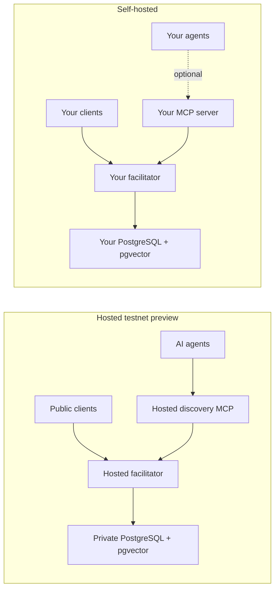

# Self-hosting openx402

openx402's required deployment is one facilitator process and one PostgreSQL
17 instance. PostgreSQL also provides pgvector when semantic search is enabled.
The MCP server is optional and runs as a separate process.

The checked-in profiles are testnet previews. Pubnet is disabled and is not
production-ready. See [Security](SECURITY.md#pubnet) before changing that.

## Deployment shapes



The hosted MCP is discovery-only. A private MCP can execute paid tools only
when its operator explicitly configures a payer signer and budgets. The
dashboard is optional and is not part of either core deployment.

## Docker quickstart

Requirements:

- Docker Engine with Compose v2.
- About 2 GB of free disk for images and PostgreSQL.
- Outbound access to Stellar testnet RPC, Horizon, and Friendbot.

No external Stellar account or hosted embedding account is required for the
default testnet profile.

From the repository root (`openx402/`):

```bash
cp .env.example .env
openssl rand -hex 16
openssl rand -base64 32
```

Put the first generated value in `.env` as `POSTGRES_PASSWORD`. Put the second
in `.env` as `FACILITATOR_KEY_ENCRYPTION_KEY`. The encryption key must decode
to exactly 32 bytes. Losing or changing it makes previously encrypted managed
keys unreadable.

From the repository root (`openx402/`):

```bash
docker compose up --build -d
docker compose ps
```

This starts:

- `postgres`: `pgvector/pgvector:pg17` with a persistent volume;
- `facilitator`: HTTP on host port `4022` by default;
- `mcp`: discovery-only Streamable HTTP on host port `4522` by default.

The testnet profile creates one sponsor and three channel accounts, encrypts
their keys in PostgreSQL, and funds missing accounts through Friendbot. The
operator does not need to set `STELLAR_TESTNET_SPONSOR_SECRET` for this flow.
The sponsor pays network fees; it never becomes payer or payment recipient.

Check the running stack from the repository root (`openx402/`):

```bash
curl -fsS http://localhost:4022/health/ready | jq
curl -fsS http://localhost:4022/supported | jq
curl -fsS 'http://localhost:4022/discovery/resources?limit=5' | jq
curl -fsS 'http://localhost:4022/discovery/search?query=weather&limit=5' | jq
curl -fsS http://localhost:4522/healthz | jq
curl -fsS http://localhost:4522/readyz | jq
```

Health and discovery routes are public. If `FACILITATOR_API_KEYS` is set, add
`Authorization: Bearer <configured-key>` when calling `/supported`, `/verify`,
`/settle`, or `/analytics/v1/*`.

`/health/ready` gates database connectivity. Search status is included in its
JSON but a missing embedding provider does not make the facilitator unready.
Stellar accounts and balances are checked before the HTTP listener starts;
the readiness endpoint is not a continuous deep RPC or Horizon check.

## Core-only deployment

MCP is not required. From the repository root (`openx402/`):

```bash
docker compose up --build -d postgres facilitator
```

This is the minimal supported architecture. One PostgreSQL instance is the
only datastore: no Redis, external queue, hosted vector database, or separate
analytics database is required.

## Configuration

The facilitator loads the YAML selected by `FACILITATOR_CONFIG`, defaulting to
`config/self-hosted.yaml` inside its container. Secrets are read through the
environment variable names referenced by that YAML.

Important environment variables in the root `.env` file:

| Variable | Purpose |
| --- | --- |
| `POSTGRES_PASSWORD` | Required Compose database password. |
| `FACILITATOR_KEY_ENCRYPTION_KEY` | Required production AES-256-GCM key for managed Stellar keys. |
| `POSTGRES_DB`, `POSTGRES_USER` | Database name and user; both default to `openx402`. |
| `FACILITATOR_PORT`, `MCP_PORT` | Host ports; default `4022` and `4522`. |
| `FACILITATOR_CONFIG` | Facilitator YAML; default `config/self-hosted.yaml`. |
| `MCP_SERVER_CONFIG` | MCP YAML; Docker default `config/railway.yaml`. |
| `FACILITATOR_API_KEYS` | Optional comma-separated bearer keys for `/supported`, `/verify`, `/settle`, and analytics. |
| `FACILITATOR_CURSOR_HMAC_KEY` | Optional stable pagination cursor key. When absent it is derived from the facilitator encryption key. |

The full key surface is in the
[facilitator configuration reference](../facilitator/docs/CONFIGURATION.md).

### Catalog origin policy

Both checked-in facilitator profiles require HTTPS for public resource URLs.
They differ for local development:

- `config/self-hosted.yaml` sets `catalog_security.allow_local_origins: true`,
  so loopback/private HTTP resources can be cataloged locally.
- `config/railway.yaml` sets it to `false`, so the hosted catalog rejects
  loopback, private, link-local, and plain-HTTP public resources.

Pubnet startup forbids local origins and requires HTTPS.

## Search profiles

The stock Docker image intentionally omits the optional local ONNX runtime.
The default self-hosted YAML selects local BGE-M3, but without
`@huggingface/transformers` the worker reports a degraded semantic provider and
search continues with PostgreSQL full-text retrieval. It does not download
model weights.

To run local embeddings, build a custom facilitator image that installs the
optional `@huggingface/transformers` peer dependency. Preserve the pinned model
repository, revision, dimension, pooling, and normalization settings unless
you intentionally create and reindex a new model generation.

For a remote OpenAI-compatible embedding provider, author a facilitator YAML
with `search.semantic.provider: remote`, then point
`search.semantic.remote_url_env` and `remote_api_key_env` at environment
variables containing the endpoint and optional bearer token. Provider errors,
timeouts, invalid dimensions, and missing pgvector degrade to lexical search.

See [Search and indexing](../facilitator/docs/SEARCH.md) for provider contracts,
generation handling, and reindex commands.

## Running MCP separately

The local MCP YAML defaults to stdio because an agent runtime normally launches
the process directly. Docker cannot expose stdio as a network service, so the
Compose service selects the Streamable HTTP Railway profile instead.

For direct local discovery-only MCP, from `openx402/mcp-server/`:

```bash
npm ci
npm run build
FACILITATOR_URL=http://localhost:4022 npm start
```

The hosted and Docker profiles use `signer.mode: none`; only
`x402_search_resources` and `x402_get_resource` are registered. Paid execution
and its authentication, signer, budget, and network requirements are described
in the [MCP server guide](../mcp-server/README.md).

## Railway one-click deployment

The [Railway template](https://railway.com/deploy/uKrE3J) creates private
PostgreSQL plus public facilitator and discovery-only MCP services. It does not
deploy the optional dashboard.

In Railway, supply:

```dotenv
OPENROUTER_API_KEY=<sealed provider key>
```

The template also sets
`FACILITATOR_EMBEDDING_URL=https://openrouter.ai/api/v1/embeddings` and generates
the database password and facilitator encryption key. The Railway profile uses
`openai/text-embedding-3-small`, remote inference, and no reranker. A provider
failure degrades search to lexical retrieval; payment endpoints remain
available.

Use the complete [Railway deployment guide](../deploy/railway/README.md) for
service variables, health checks, and hardening.

## Operations

All facilitator replicas must share the same PostgreSQL database and
`FACILITATOR_KEY_ENCRYPTION_KEY`. PostgreSQL coordinates channel leases,
idempotency, fee budgets, indexing jobs, and recovery across replicas.

Back up from an operator shell with PostgreSQL client tools installed. Run from
the directory where the backup should be written:

```bash
pg_dump "$DATABASE_URL" --format=custom --file=openx402.dump
```

Restore into an empty target database before starting facilitator replicas. Run
from the directory containing `openx402.dump`:

```bash
pg_restore --dbname="$DATABASE_URL" --clean --if-exists openx402.dump
```

Drain traffic before key operations. With `DATABASE_URL` and
`FACILITATOR_KEY_ENCRYPTION_KEY` exported, from `openx402/facilitator/`:

```bash
npm ci
STELLAR_SECRET=S... npm run keys -- rotate-sponsor stellar:pubnet
STELLAR_SECRET=S... npm run keys -- add-channel stellar:pubnet
npm run keys -- disable-channel stellar:pubnet G...
```

Rotation refuses while a settlement is unresolved. Rotate the encryption key
only through an offline database re-encryption procedure; changing the
environment value under existing ciphertext is not rotation.

Monitor database availability, sponsor/channel XLM balances, unresolved
settlements, rejected fees, sponsor-budget consumption, RPC latency, search job
backlog, stale catalog resources, and the `upto` contract-instance and Wasm-code
TTLs.

## Next steps

- [Architecture](ARCHITECTURE.md)
- [Security](SECURITY.md)
- [Troubleshooting](TROUBLESHOOTING.md)
- [Facilitator configuration](../facilitator/docs/CONFIGURATION.md)
