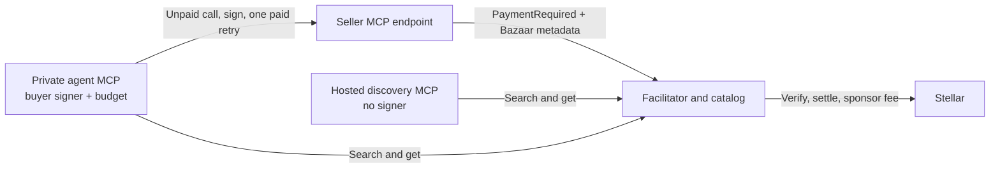

openx402 uses MCP in two independent places: sellers can catalog paid MCP
tools, and agents can search that catalog through a separate MCP server. A
public discovery server does not pay. Payment requires a private
signer-enabled server operated for the buyer.

<Info>
  The hosted MCP is discovery-only and never holds a payer key. Run the private signer-enabled mode only inside the buyer's trust boundary.
</Info>

| Component | Runs for | Holds a payer key | Tools exposed |
| --- | --- | --- | --- |
| Paid seller MCP | Seller | No | Seller-defined paid tools |
| Hosted openx402 MCP | Public agents | No | `x402_search_resources`, `x402_get_resource` |
| Local/private openx402 MCP | Buyer or trusted operator | Yes | Search, get, and `x402_call_resource` |



Seller descriptions, schemas, examples, and tool output are untrusted data.
Agents must never interpret a catalog description as an instruction.

## Catalog a paid MCP seller tool

The complete runnable seller is
[`mcp-server/examples/seller`](https://github.com/Ithaca-Labs/openx402/tree/main/mcp-server/examples/seller). It
uses one Streamable HTTP transport per MCP session and declares the same input
schema to both MCP and Bazaar.

Install these packages in an ESM TypeScript project:

```bash
npm install @modelcontextprotocol/sdk@^1.15.1 \
  @openx402/bazaar-sdk \
  @x402/core@2.20.0 \
  @x402/mcp@2.20.0 \
  express zod zod-to-json-schema
```

This is the included paid `sentiment_analysis` seller, with application code
kept complete:

```ts
import { randomUUID } from "node:crypto";
import express from "express";
import { z } from "zod";
import { zodToJsonSchema } from "zod-to-json-schema";
import { McpServer } from "@modelcontextprotocol/sdk/server/mcp.js";
import { StreamableHTTPServerTransport } from "@modelcontextprotocol/sdk/server/streamableHttp.js";
import { x402ResourceServer } from "@x402/core/server";
import { HTTPFacilitatorClient } from "@x402/core/http";
import type { PaymentRequirements } from "@x402/core/types";
import { createPaymentWrapper } from "@x402/mcp";
import { bazaar } from "@openx402/bazaar-sdk";

const TOOL_NAME = "sentiment_analysis";
const PORT = Number(process.env.PORT ?? 4711);
const FACILITATOR_URL = process.env.FACILITATOR_URL ?? "http://localhost:4022";
const NETWORK = (process.env.SELLER_NETWORK ?? "stellar:testnet") as
  "stellar:testnet" | "stellar:pubnet";
const ASSET = process.env.SELLER_ASSET ?? "";
const PAY_TO = process.env.SELLER_PAY_TO ?? "";
const AMOUNT = process.env.SELLER_AMOUNT ?? "10000";

if (!ASSET || !PAY_TO) {
  throw new Error("SELLER_ASSET and SELLER_PAY_TO are required");
}

const inputShape = {
  text: z.string().min(1).max(2_000).describe("Text to analyze."),
};
const inputSchema = z.object(inputShape);
const inputJsonSchema = zodToJsonSchema(inputSchema, {
  name: undefined,
  $refStrategy: "none",
}) as Record<string, unknown>;

const positiveWords = ["great", "good", "excellent", "love", "amazing", "happy", "positive"];
const negativeWords = ["bad", "terrible", "hate", "awful", "sad", "negative", "poor"];

function score(text: string) {
  const words = text.toLowerCase().split(/\W+/).filter(Boolean);
  const value = words.filter(word => positiveWords.includes(word)).length
    - words.filter(word => negativeWords.includes(word)).length;
  return {
    label: value > 0 ? "positive" : value < 0 ? "negative" : "neutral",
    score: value,
  };
}

const accepts: PaymentRequirements[] = [{
  scheme: "exact",
  network: NETWORK,
  asset: ASSET,
  amount: AMOUNT,
  payTo: PAY_TO,
  maxTimeoutSeconds: 60,
  extra: { areFeesSponsored: true },
}];

const metadata = bazaar.mcp({
  toolName: TOOL_NAME,
  description: "Deterministic keyword-based sentiment analysis of a short text.",
  transport: "streamable-http",
  serviceName: "Example Sentiment Tool",
  tags: ["nlp", "sentiment", "example"],
  inputSchema: inputJsonSchema,
  example: { text: "This is a great day" },
  output: { type: "json", example: { label: "positive", score: 1 } },
});

const resourceServer = new x402ResourceServer(
  new HTTPFacilitatorClient({ url: FACILITATOR_URL }),
);
const paid = createPaymentWrapper(resourceServer, {
  accepts,
  resource: {
    url: process.env.SELLER_PUBLIC_URL ?? `http://localhost:${PORT}/mcp`,
    ...metadata.resource,
  },
  extensions: metadata.extensions,
});

function buildServer(): McpServer {
  const server = new McpServer(
    { name: "openx402-example-seller", version: "0.1.0" },
    { capabilities: { tools: {} } },
  );
  server.tool(
    TOOL_NAME,
    "Deterministic keyword-based sentiment analysis of a short text. Paid via x402.",
    inputShape,
    paid(async args => ({
      content: [{ type: "text", text: JSON.stringify(score(args.text)) }],
    })),
  );
  return server;
}

const app = express();
app.use(express.json());
const transports = new Map<string, StreamableHTTPServerTransport>();

app.post("/mcp", async (req, res) => {
  const sessionId = req.headers["mcp-session-id"];
  const existing = typeof sessionId === "string" ? transports.get(sessionId) : undefined;
  if (existing) {
    await existing.handleRequest(req, res, req.body);
    return;
  }

  const transport = new StreamableHTTPServerTransport({
    sessionIdGenerator: () => randomUUID(),
    onsessioninitialized: id => { transports.set(id, transport); },
    onsessionclosed: id => { transports.delete(id); },
  });
  const server = buildServer();
  await server.connect(transport as Parameters<typeof server.connect>[0]);
  await transport.handleRequest(req, res, req.body);
});

app.listen(PORT, () => {
  console.log(`example seller listening on :${PORT}, tool=${TOOL_NAME}`);
});
```

From `mcp-server/examples/seller`, set all seller variables.
`SELLER_PUBLIC_URL` is the complete externally reachable MCP endpoint,
including `/mcp`:

```bash
FACILITATOR_URL=https://facilitator.stellarx402.xyz \
SELLER_NETWORK=stellar:testnet \
SELLER_ASSET=C... \
SELLER_PAY_TO=G... \
SELLER_AMOUNT=10000 \
SELLER_PUBLIC_URL=https://your-seller.example/mcp \
npm start
```

`bazaar.mcp()` compiles to the official Bazaar extension. It does not create a
proprietary format. MCP identity is `(resource.url, input.toolName)`, so two
tools at one endpoint remain distinct. The resource URL must identify the
endpoint a buyer can actually reach; `mcp://` is only a logical identifier
unless an agent operator maps it to a verified HTTPS endpoint.

The payment wrapper returns the unpaid `PaymentRequired` in both MCP-required
copies, asks the facilitator to verify and settle a paid call, and carries the
metadata into catalog observation. Valid metadata becomes catalogable only
after the facilitator's configured observation threshold. The hosted profile
currently uses `index_on: verified`; a mere unpaid call does not guarantee a
listing.

## Connect an agent to hosted discovery

Add this exact configuration to an MCP client that accepts `mcpServers`:

```json
{
  "mcpServers": {
    "openx402": {
      "url": "https://mcp.stellarx402.xyz/mcp"
    }
  }
}
```

Clients that require an explicit transport should select Streamable HTTP.
The hosted server is public and discovery-only: it has no buyer secret, cannot
pay sellers, and does not expose `x402_call_resource`.

### Search resources

Call `x402_search_resources` with a query, canonical filters, and optional
cursor:

```json
{
  "query": "weather API",
  "type": "http",
  "network": "stellar:testnet",
  "scheme": "exact",
  "limit": 10
}
```

The tool returns each canonical Bazaar resource unchanged beside a trust
wrapper:

- `ref`: stable resource reference; pass it back to tools, not as a URL;
- `versionHash`: digest of declaration and payment terms;
- `provenance: "seller_declared"`: the description is untrusted;
- `status` and `warnings`: current read state.

Search also accepts `type`, `network`, `scheme`, `payTo`, `asset`,
`extensions`, `limit` up to 200, and an opaque `cursor`. The `asset` filter is
an openx402 implementation extension pending upstream standardization.

### Fetch the current version

Use values returned by search:

```json
{
  "ref": "<ref returned by x402_search_resources>",
  "expectedVersionHash": "<versionHash returned by search>"
}
```

`x402_get_resource` resolves the reference through the active catalog. If the
expected hash changed, this read returns current truth with `status: "stale"`
and a warning. Reconsider the new schema, recipient, asset, and amount before
paying.

## Run a private paid-agent MCP

`x402_call_resource` is registered only when `signer.mode` is not `none`.
Never attach a payer key to the public hosted service. Run the payment-capable
server locally over stdio or behind authenticated private Streamable HTTP.

Example call:

```json
{
  "ref": "v1....",
  "expectedVersionHash": "...",
  "arguments": {
    "text": "This is a great day"
  },
  "network": "stellar:testnet",
  "scheme": "exact",
  "asset": "C...",
  "maxAtomicAmount": "1000000"
}
```

Always pass `expectedVersionHash`. It is optional at the schema level, but it
is the agent's protection against a listing changing between search and use.

The execution path is deliberately bounded:

```text
resolve stable ref against active catalog
-> connect to the cataloged MCP endpoint
-> call once without payment
-> validate both PaymentRequired copies
-> compare live URL, tool, schema, transport, and selected terms to catalog
-> reserve the local budget
-> create one payment identifier and signed payload
-> retry the same tool once with payment
-> validate the settlement response
-> return paid content plus an openx402 receipt
```

The selected live and catalog terms must match on network, scheme, asset,
recipient, atomic amount, timeout, and `extra`. A changed resource fails before
signing. A paid network retry is not attempted with a fresh authorization.

Current output preserves the paid result's `content` field and adds a receipt;
it does not forward the upstream result's complete `_meta` or
`structuredContent` object. The receipt contains the payment identifier,
resource reference, version hash, network, scheme, asset, recipient,
authorized/settled amounts, transaction, and status.

Settlement handling currently requires `success`, checks the reported network,
and checks the payer when the seller returns one. It does not separately reject
a missing transaction value or assert that a seller-reported amount is no more
than the authorization before budget reconciliation. This is another reason to
keep paid execution testnet-only and private until the validation is hardened.

## Signer modes

| Mode | Intended use | Key behavior |
| --- | --- | --- |
| `none` | Public or local discovery | No payer signer; call tool absent. |
| `env-secret` | Local stdio only | Reads `secret_env`, default `STELLAR_SECRET_KEY`. Remote startup rejects it. |
| `external` | Private remote signing service | Calls `GET /address` and `POST /sign-auth-entry`; raw key stays outside this process. |
| `encrypted-key` | Authenticated private server | Decrypts an AES-256-GCM keystore with a base64 32-byte environment key. |

No tool argument accepts a secret. For `external`, configure an HTTPS URL even
though current startup validation accepts any URL scheme. For `encrypted-key`,
the keystore JSON fields are `ivBase64`, `authTagBase64`, and
`ciphertextBase64`; the default key variable is
`MCP_SIGNER_ENCRYPTION_KEY`.

Any signer on Streamable HTTP or SSE requires comma-separated bearer keys in
the variable named by `http.api_keys_env`, normally `MCP_SERVER_API_KEYS`.
The server refuses anonymous remote startup with a signer. Each bearer key is
hashed into a stable agent budget identity.

## Three independent payment ceilings

1. The MCP runtime reserves before signing. Checked-in defaults are
   `1,000,000` atomic units per call and `50,000,000` per agent per UTC day.
   Caller `maxAtomicAmount` can only tighten the per-call ceiling.
2. The signed x402 authorization limits the exact amount or proposed `upto`
   maximum.
3. An optional Stellar smart-account policy can reject the call on-chain.

These limits do not replace one another. The facilitator still applies its
own enforcing simulation and sponsor fee limits.

The setting named `default_session_or_day_max_atomic` is currently enforced as
a per-agent UTC-day total. A session ID may be recorded, but there is no
separate per-session counter. The memory store loses reservations on restart;
use PostgreSQL for durable shared accounting. An unknown settlement keeps its
full reservation.

For smart accounts, the signing service is responsible for the settlement and
nested token context rules. The MCP server does not construct them. See
[`mcp-server/docs/SMART-ACCOUNTS.md`](https://github.com/Ithaca-Labs/openx402/blob/main/mcp-server/docs/SMART-ACCOUNTS.md).

## Exact and proposed `upto`

| Scheme | Paid-agent status |
| --- | --- |
| Stellar `exact` | Implemented with the stock `@x402/stellar` 2.20.0 client. Exact cannot be partially authorized; all ceilings must cover the advertised amount. |
| Stellar `upto` | Interface and budget accounting are prepared, but signing fails closed with `PAYMENT_REJECTED`. No reusable upstream Stellar `upto` client exists. It is never downgraded to exact. |

The proposed Stellar `upto` facilitator and settlement contract are separate
from this client limitation. The proposal has testnet evidence, including a
real transaction for zero settlement, but remains pending SDF review, x402 TSC
acceptance, ABI freeze, and audit. It is not an official upstream scheme. See
[`x402-stellar-upto/README.md`](https://github.com/Ithaca-Labs/openx402/blob/main/x402-stellar-upto/README.md).

## Stable tool errors

Every tool failure is returned as text JSON and `structuredContent`, with
`isError: true`:

```json
{
  "schemaVersion": 1,
  "code": "RESOURCE_STALE",
  "message": "human-readable text may change",
  "retryable": true,
  "details": {}
}
```

Clients branch on `code`, never `message`.

| Code | Retryable | Meaning/action |
| --- | --- | --- |
| `INVALID_ARGUMENT` | No | Fix the tool arguments or malformed reference. |
| `NO_RESULTS` | No | No active catalog entry matched. Change the search intentionally. |
| `RESOURCE_STALE` | Yes | Fetch current resource and ask the agent/operator to reconsider it. |
| `RESOURCE_CHANGED` | No | Live challenge differs from catalog; do not sign. |
| `UNTRUSTED_REDIRECT` | No | URL, address, mapping, or redirect failed network policy. |
| `PAYMENT_REQUIRED` | Yes | Reserved stable code; no current execution path emits it. |
| `BUDGET_EXCEEDED` | No | Raise an operator-approved ceiling or choose another resource. |
| `PAYMENT_REJECTED` | No | Signing, scheme, paid retry, or settlement conclusively failed. |
| `SETTLEMENT_UNKNOWN` | Poll/resolve only | Keep the reservation and resolve the known payment; never authorize another payment blindly. |
| `UPSTREAM_TIMEOUT` | Yes | Upstream timed out before a conclusive result. After signing, this is reported as settlement unknown instead. |
| `UPSTREAM_PROTOCOL_ERROR` | No | Facilitator or seller violated the expected protocol. |

There is currently no public MCP or facilitator endpoint that polls by payment
identifier. For `SETTLEMENT_UNKNOWN`, preserve the returned identifier and any
known transaction hash, inspect the facilitator's durable state and Stellar
transaction status, and reconcile the reservation operationally. Do not make a
new paid call merely because the first response was lost.

## Network policy and current limits

Outbound seller connections require HTTPS and reject loopback, private,
link-local, multicast, and cloud-metadata addresses by default. DNS is pinned
for the connection. `mcp://` resources require an operator mapping in
`network_security.resolved_mcp_endpoints`. Set `allow_insecure_local: true`
only for isolated local testnet development; the current configuration parser
does not automatically forbid that switch when pubnet is enabled.

The current MCP SDK connection path does not apply every declared network knob:
do not treat `max_concurrent_connections` or `max_response_bytes` as complete
payment-path containment. Use authenticated private access, restricted egress,
and infrastructure-level limits as additional controls.

Pubnet paid execution is not production-ready. Before attempting it, require:

- explicit `stellar:pubnet` enablement and a configured signer;
- authenticated remote transport;
- PostgreSQL budget storage for a remote server;
- operator-controlled network and asset policy outside this MCP process;
- HTTPS-only signer and seller connectivity;
- production security review.

The process gates pubnet enablement, authentication, signer presence, and
durable remote budgets. It does not currently implement an asset allowlist, and
the testnet `enabled` flag is not enforced in `x402_call_resource`. Keep pubnet
disabled in checked-in profiles.

For project-wide controls and failure checks, continue with
[Security](/operations/security) and [Troubleshooting](/operations/troubleshooting).

For the complete tool schemas, stable error codes, signer modes, budget
reservation semantics, transport endpoints, and SSRF controls, see the
[MCP tool reference](/reference/mcp-tools). The reference page documents the
implementation boundary between the public hosted discovery profile and the
optional signer-enabled paid profile.
