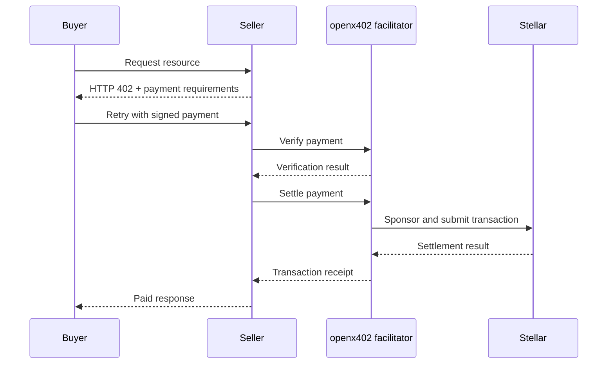

openx402 is a permissively licensed, self-hostable x402 v2 facilitator for Stellar. Use it to protect HTTP or MCP resources, sponsor network fees without custodying seller funds, catalog services through Bazaar, and give agents a discovery surface.

<Badge color="yellow" shape="pill" icon="flask-conical">
  Public Stellar testnet preview
</Badge>

<Warning>
  Stellar `exact` is live and canonical-client tested on testnet. Stellar `upto` is proposed, and pubnet remains disabled in checked-in profiles. Review [security and release status](/operations/security) before operating beyond testnet.
</Warning>

<Columns cols={3}>
  <Card title="Complete a paid request" icon="zap" href="/quickstart" cta="Run the quickstart">
    Start a seller, make a real testnet payment, and confirm automatic Bazaar cataloging.
  </Card>
  <Card title="Protect a resource" icon="shield-check" href="/guides/http-seller" cta="Build a seller">
    Add Stellar payment requirements and official Bazaar metadata to an Express endpoint.
  </Card>
  <Card title="Deploy your own stack" icon="server-cog" href="/operations/self-hosting" cta="Self-host openx402">
    Run the facilitator and PostgreSQL with optional semantic search and MCP discovery.
  </Card>
</Columns>

## What ships

| Component | Purpose | Required |
| --- | --- | --- |
| Facilitator | Verifies and settles payments, sponsors fees, catalogs resources, and serves discovery | Yes |
| PostgreSQL 17 + pgvector | Stores protocol state, keys, channel leases, budgets, catalog data, and search vectors | Yes |
| MCP server | Exposes Bazaar search and optional guarded paid execution to agents | No |
| `@openx402/bazaar-sdk` | Gives sellers typed helpers for official Bazaar metadata | Seller-side only |
| Stellar `upto` package | Contains the proposed scheme, Soroban contract, tests, and evidence | Only for `upto` |

## How a payment flows

The facilitator validates payment data and settles on Stellar. It never proxies the seller's application request, executes seller code, or becomes custodian of seller funds.

## Choose your path

<Columns cols={2}>
  <Card title="Seller developer" icon="store" href="/guides/http-seller">
    Protect an HTTP resource or [catalog a paid MCP tool](/guides/mcp#catalog-a-paid-mcp-seller-tool).
  </Card>
  <Card title="Buyer developer" icon="wallet-cards" href="/guides/buyer-client">
    Validate a challenge, sign the canonical Stellar payload, retry once, and inspect settlement.
  </Card>
  <Card title="Agent builder" icon="bot" href="/guides/mcp">
    Search hosted discovery or run a private signer-enabled MCP with independent payment ceilings.
  </Card>
  <Card title="Infrastructure operator" icon="hard-drive" href="/operations/self-hosting">
    Deploy, configure, monitor, rotate keys, and understand the system's fixed security invariants.
  </Card>
</Columns>

<Info>
  Seller metadata is untrusted. A catalog entry marked `payment_observed` means the facilitator validated payment terms carried with that listing; it does not prove origin ownership, accuracy, availability, or quality.
</Info>
