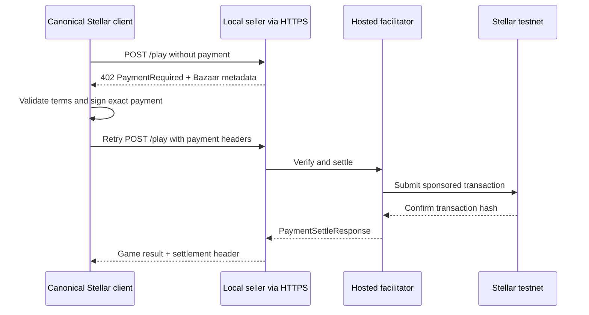

Build, pay, and catalog a real paid HTTP endpoint on Stellar testnet.

## What openx402 provides

openx402 is a self-hostable x402 v2 facilitator for Stellar. It verifies and
settles payments, sponsors Stellar transaction fees, records Bazaar metadata,
and exposes HTTP and MCP discovery.

This tutorial uses the hosted public testnet services:

| Service | URL | Role |
| --- | --- | --- |
| Facilitator | `https://facilitator.stellarx402.xyz` | Verify, settle, sponsor fees, and catalog |
| Discovery MCP | `https://mcp.stellarx402.xyz/mcp` | Search and inspect catalog entries only |

You will run the included Rock Paper Scissors seller and canonical paying
client locally. The hosted MCP does not hold a buyer key and cannot pay.

<Warning>
  `exact` is implemented and live on testnet with the canonical client. Stellar `upto` is a proposed scheme. Pubnet is disabled and is not production-ready.
</Warning>

## Prerequisites

- Node.js 22 or newer
- npm
- a Stellar testnet buyer secret key (`S...`) for an account holding testnet XLM
- a Stellar testnet seller address (`G...`)
- an HTTPS tunnel that forwards a public origin to `http://127.0.0.1:4788`
- `curl` and `jq` for the catalog check

Use a testnet-only buyer account. Never commit or paste a valuable secret into
browser code. This example charges 1,000 atomic units of testnet native XLM
through its Stellar Asset Contract.

If you just funded the buyer with Friendbot, wait until the account is visible
to Soroban RPC before running the client. The canonical Stellar client performs
a pre-signing simulation, and a newly created account can take a few ledgers to
propagate from Horizon to RPC.

## Why the seller needs a public HTTPS URL

The payment challenge and Bazaar metadata must describe the URL the buyer
actually calls. Set `SELLER_PUBLIC_URL` to the tunnel origin, not the local
listener.

The hosted catalog rejects loopback/private origins and plain-HTTP public
resources. A value such as `http://127.0.0.1:4788` is valid for local-only
testing but cannot become a hosted listing.

<Steps>
<Step title="Install the example">

From the repository root:

```bash
cd examples/rock-paper-scissors
npm install
```

</Step>
<Step title="Start the seller">

Start your HTTPS tunnel first and forward it to port `4788`. Then, from
`examples/rock-paper-scissors`:

```bash
SELLER_PUBLIC_URL=https://your-tunnel.example \
SELLER_PAY_TO=G... \
FACILITATOR_URL=https://facilitator.stellarx402.xyz \
npm run server
```

The process listens on `127.0.0.1:4788` and prints its local URL, public URL,
facilitator, seller address, asset contract, and atomic amount. Leave it
running.

The addresses have distinct roles:

- `SELLER_PAY_TO` receives the payment asset.
- the buyer address owns and authorizes the payment asset.
- the facilitator sponsor address pays the Stellar network fee only.
- the token contract address identifies the payment asset.

The facilitator is never the payer or recipient.

</Step>
<Step title="Run the paying client">

Open another terminal in `examples/rock-paper-scissors`:

```bash
SELLER_URL=https://your-tunnel.example/play \
BUYER_SECRET_KEY=S... \
npm run client
```

The output is JSON with three sections:

- `paymentRequired`: selected scheme, network, asset, amount, recipient,
  resource, and Bazaar declaration;
- `settlement`: the canonical `PaymentSettleResponse`, including a real testnet
  transaction hash;
- `result`: the player move, random server move, and result.

The request flow is:



The first request receives HTTP 402. The canonical client parses
`PaymentRequired`, creates and signs a Stellar `exact` payment, encodes the
payment headers, and retries the same application request. The seller asks the
facilitator to verify and settle. The facilitator pays the network fee while
the buyer supplies the payment asset. The successful response includes the game
result and a settlement response containing the testnet transaction hash.

</Step>
<Step title="Confirm automatic cataloging">

From any directory:

```bash
curl -fsS \
  'https://facilitator.stellarx402.xyz/discovery/search?query=rock%20paper%20scissors' \
  | jq
```

Look for the public tunnel URL and the `Rock Paper Scissors` service name.

Cataloging is a configured side effect, not an unconditional result of every
402 response. The hosted facilitator uses `index_on: verified`: valid Bazaar
metadata becomes catalogable after a successful configured payment
observation. Invalid metadata soft-fails without invalidating an otherwise
valid payment. A listing records `payment_observed`; it does not prove origin
ownership or service quality.

</Step>
</Steps>

## What to read next

- [Build a paid HTTP seller](/guides/http-seller)
- [Use the seller SDK](/guides/seller-sdk)
- [Understand the canonical buyer](/guides/buyer-client)
- [Declare and search Bazaar metadata](/concepts/bazaar)
- [Understand hybrid search](/concepts/search)
- [Catalog and discover paid MCP tools](/guides/mcp)
- [Build a metered resource with proposed `upto`](/guides/upto)
- [Deploy your own facilitator](/operations/self-hosting)
- [Tune the deployment](/reference/configuration)
- [Use the HTTP API](/reference/api)
- [Troubleshoot the flow](/operations/troubleshooting)
